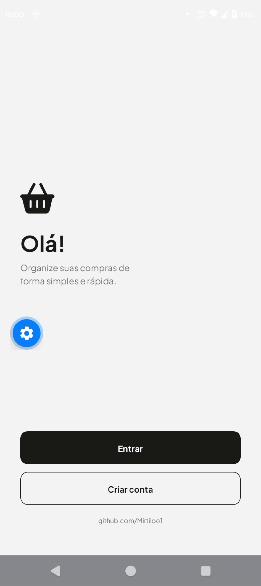
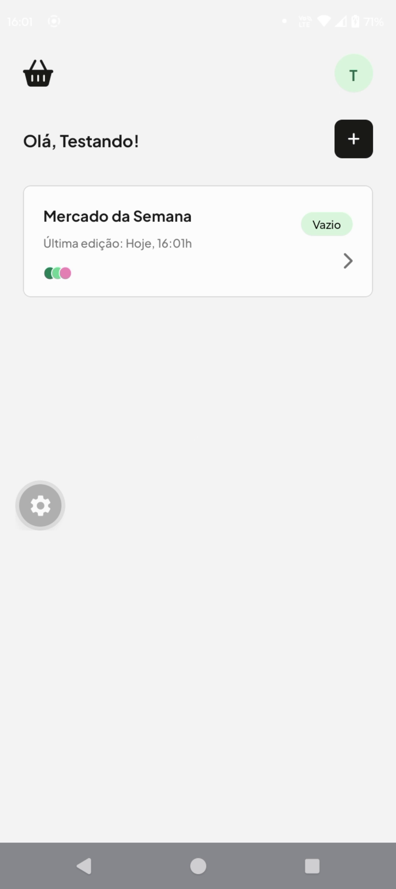
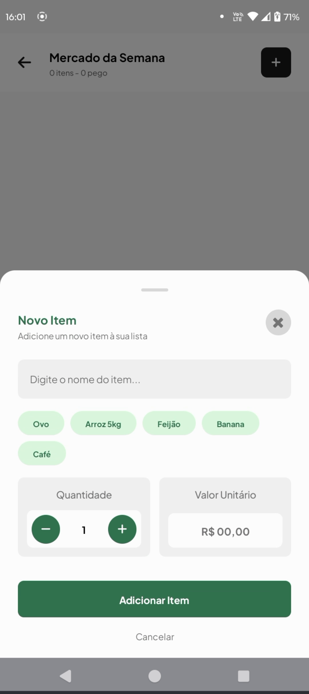
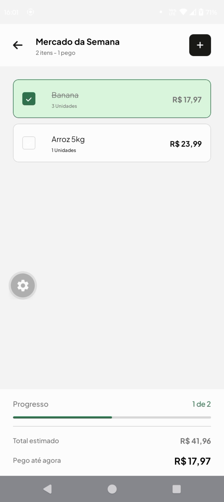

# Lista de Compras App

Aplicativo mobile para gerenciamento de listas de compras. Desenvolvido em React Native com Expo, consumindo uma API REST para autenticação e sincronização dos dados.

## Tecnologias

- React Native
- Expo
- TypeScript
- Expo Router
- React Navigation
- Axios
- Zustand
- Expo Secure Store
- React Native Reanimated

## Funcionalidades

- Cadastro e login de usuários
- Autenticação com JWT
- Criação e exclusão de listas de compras
- Adição e remoção de itens
- Marcação de itens como pegos
- Cálculo automático do valor total da lista
- Persistência segura da sessão do usuário
- Interface responsiva para Android e iOS

## Rodando o projeto

**Pré-requisitos:**

- Node.js
- npm
- Expo Go ou Android Studio

Clone o repositório:

```bash
git clone https://github.com/Mirtiloo1/lista-de-compras-app.git
cd lista-de-compras-app
```

Instale as dependências:

```bash
npm install
```

Inicie o aplicativo:

```bash
npx expo start
```

Depois basta abrir pelo Expo Go ou executar em um emulador Android/iOS.

> **Observação:** O aplicativo já está configurado para consumir a API hospedada no Render.

## Estrutura do projeto

```text
src/
├── app/            # Rotas e telas do Expo Router
├── components/     # Componentes reutilizáveis
├── services/       # Comunicação com a API
├── store/          # Gerenciamento do estado global de autenticação
├── constants/      # Constantes da aplicação
```

## Backend

A API utilizada pelo aplicativo está hospedada no Render e utiliza PostgreSQL hospedado no Supabase.

Repositório da API:

https://github.com/Mirtiloo1/listinha-api

## Download

Baixe a versão mais recente do aplicativo:

**APK:** *https://github.com/Mirtiloo1/lista-de-compras-app/releases/tag/v1.0.0*

## Telas

- Login
- Cadastro
- Listas de compras
- Itens da lista
- Perfil

## Screenshots

<p align="center">
  
  
</p>

<p align="center">
  
  
</p>
## Licença

Este projeto foi desenvolvido para fins de estudo.

---

Desenvolvido por [@mirtiloo1](https://github.com/Mirtiloo1)
